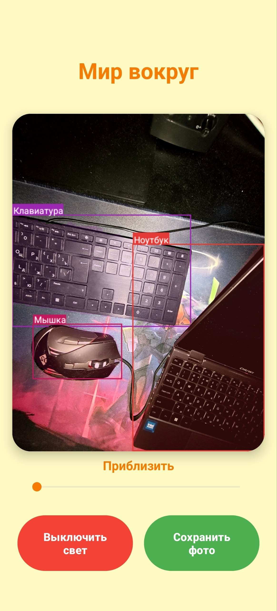
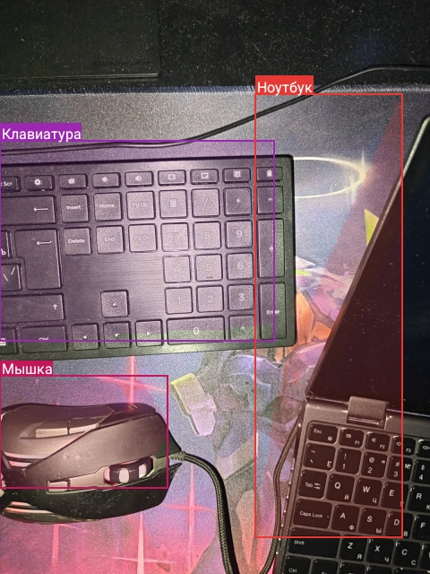

# The World Around

An Android application that leverages computer vision for real-time object segmentation. It identifies items via the camera, highlights them with masks, and announces their names in Russian using Text-To-Speech (TTS).

---

## 📸 Screenshots
<p align="center">
  
  
</p>

---

## ✨ Key Features

*   **Real-time Segmentation**: Powered by the **YOLO11n-seg** model for precise object detection and contour highlighting.
*   **TTS Integration**: Tap on any segmented object to hear its name in Russian.
*   **Zoom Control**: Interactive SeekBar for digital and optical zoom management.
*   **Photo Capture**: Save snapshots combining the original frame and the segmentation mask to the gallery.
*   **Flashlight Support**: Toggle camera flash for better visibility in low-light environments.

## 🎤 How TTS Works
The application uses the Android Text-to-Speech framework:
1.  **Detection**: The user taps on a specific coordinate on the `ivTop` (overlaying the camera preview).
2.  **Mapping**: The app checks if any detected object's bounding box contains that point.
3.  **Translation**: The English class name (e.g., "cup") is sent to `TranslationHelper`.
4.  **Speech**: The Russian translation ("Чашка") is passed to the TTS engine for immediate audio output.

## 🧠 Supported Objects (80 Classes)
The model is trained on the COCO dataset and can recognize 80 different classes, including:
*   **Transport**: car, motorcycle, bicycle, airplane, bus, train, truck, boat.
*   **People**: person.
*   **Animals**: dog, cat, bird, horse, sheep, cow, elephant, bear, zebra, giraffe.
*   **Household items**: cell phone, laptop, tv, bed, dining table, chair, cup, fork, knife, etc.

---

## 📂 Project Structure
```text
the world around/
├── app/
│   ├── src/main/
│   │   ├── java/com/theworldaround/     # Main logic (Activities, ML, Utils)
│   │   ├── assets/                      # TFLite model (yolo11n-seg_float16.tflite)
│   │   └── res/                         # UI layouts, drawables, and strings
│   ├── build.gradle.kts                 # Module-level build configuration
│   └── .gitignore                       # Module-specific git ignore
├── screenshots/                         # Preview images for README
├── LICENSE                              # MIT License file
├── README.md                            # Project documentation
└── build.gradle.kts                     # Project-level build configuration
```

---

## 🚀 Installation

### 1. Clone the Repository
```bash
git clone https://github.com/mar5ean/Development-of-an-educational-application-using-AR.git
```

### 2. Setup
1.  Open the project in **Android Studio**.
2.  Wait for Gradle synchronization.
3.  Ensure `yolo11n-seg_float16.tflite` is in the `app/src/main/assets/` directory.

### 3. Build or Download APK
*   **Download ready-to-use APK**: [app-debug.apk](app-debug.apk) (directly from this repository).
*   **Or build it yourself**: Go to `Build` -> `Build Bundle(s) / APK(s)` -> `Build APK(s)`.
*   The generated APK will be located at:  
    `app/build/outputs/apk/debug/app-debug.apk`

---

## 🛠 Tech Stack
*   **Language**: Kotlin
*   **ML Engine**: TensorFlow Lite (YOLO11)
*   **Camera**: CameraX API
*   **UI**: Material Design, View Binding
*   **Audio**: Android TTS Framework

---

## 📜 License
This project is licensed under the **MIT License**. See the [LICENSE](LICENSE) file for details.

---

## 🎓 Project Information
This application was developed as part of a **course project** focusing on the implementation of computer vision technologies for educational and assistive purposes.
